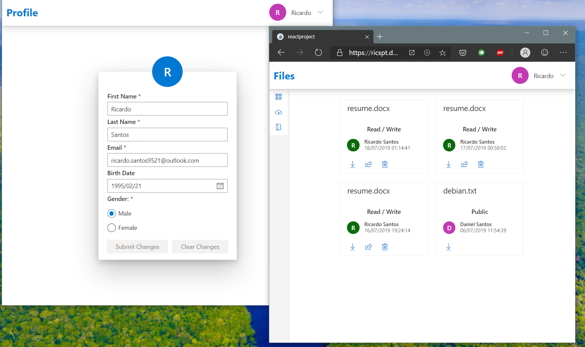

# reactProject

This project was built with the intuit of learning new things about reactjs, typescript and PWA (progressive web apps) as well as to be a base for future projects.

It allows:
- login with google to authenticate with the backend (adaptable to other id providers)
- manage profile
- manage sessions
- files upload/download and share
- ... (simple things that can be used by other projects)

# This project has two parts:

## A backend (backendproject) built with asp.net core (C#):
Has the job to authenticate the user, connect with the database (MySQL) and manage all requests from the client (profile, sessions, files, ...).

## A client (reactproject) built with ReactJS and Typescript:
The client side has the ui and all the core required to communicate with the backendproject.

# Docker, Kubernetes and Azure Pipelines:

Both parts of this project are built with docker and then deployed using kubernetes into a home cluster. The build and deployment are managed with azure pipelines.

# Project online at:

WebApp online in: https://ricspt.ddns.net/reactproject

Backend online in: https://ricspt.ddns.net/backendproject/api/version